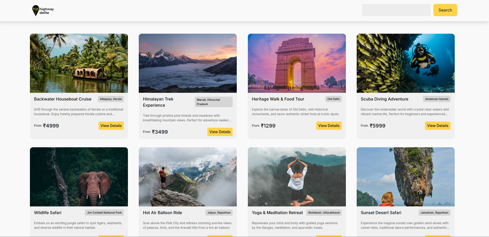

# BookIt: Experiences & Slots

A full-stack travel booking platform where users can explore travel experiences, select available time slots, and complete bookings with promo code support.

## 🚀 Live Demo

[See Live](https://bookit-srpo.onrender.com)

## Screenshots



## ✨ Features

- **Browse Experiences**: View a curated list of travel experiences with images and details
- **Slot Selection**: Choose from available dates and time slots for each experience
- **Real-time Availability**: Dynamic slot availability checking to prevent double-bookings
- **Promo Codes**: Apply discount codes (SAVE10, FLAT100) during checkout
- **Booking Confirmation**: Complete booking flow with success/failure feedback
- **Responsive Design**: Fully responsive UI matching Figma design specifications
- **Form Validation**: Client-side validation for user inputs

## 🛠 Tech Stack

### Frontend

- **Framework**: React 18 with TypeScript
- **Build Tool**: Vite
- **Styling**: TailwindCSS
- **HTTP Client**: Axios
- **Routing**: React Router v6
- **State Management**: React Hooks (useState, useEffect)

### Backend

- **Runtime**: Node.js
- **Framework**: Express.js
- **Database**: MongoDB
- **ORM**: Mongoose
- **CORS**: Enabled for cross-origin requests

## 🚦 Getting Started

### Prerequisites

- Node.js (v16 or higher)
- npm or yarn
- PostgreSQL (v12 or higher)
- Git

### Installation

1. **Clone the repository**

```bash
git clone https://github.com/whogoodluck/BookIt.git
cd BookIt
```

2. **Backend Setup**

```bash
cd backend
npm install
```

3. **Environment Setup**

Create `.env` file in the backend directory:

```env
PORT=3000
MONGO_URI=mongodb://localhost:27017
```

4. **Seed Database (Optional)**

```bash
npm run seed
```

5. **Start Backend Server**

```bash
npm run dev
# Server runs on http://localhost:3000
```

6. **Frontend Setup** (Open new terminal)

```bash
cd ../frontend
npm install
```

7. **Start Frontend Development Server**

```bash
npm run dev
# App runs on http://localhost:5173
```

**Figma Link**: [View Design](https://www.figma.com/design/8X6E1Ev8YdtZ3erV0Iifvb/HD-booking?node-id=0-
1&p=f&t=K4scwnxfIHmfbb2a-0)

## 📝 Features Implemented

- ✅ Experience listing with search/filter
- ✅ Dynamic slot availability
- ✅ Real-time booking validation
- ✅ Promo code system
- ✅ Double-booking prevention
- ✅ Form validation
- ✅ Loading states and error handling
- ✅ Responsive design
- ✅ Success/failure feedback
